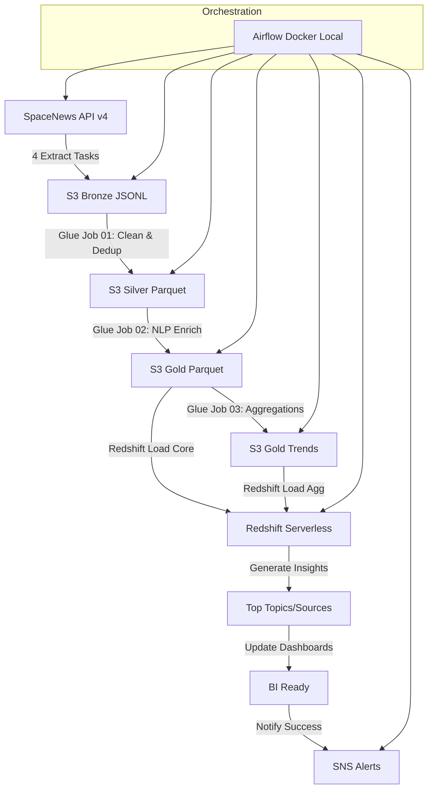

# SpaceNews Data Pipeline Architecture

## AWS Architecture Overview



- **S3 Data Lake**: Bronze/Silver/Gold medallion architecture with partitioning by `ingest_date`
- **AWS Glue (Spark)**: Three ETL jobs for cleaning, NLP enrichment, and monthly trend aggregations
- **Redshift Serverless**: Data warehouse with SCD Type 2 for content_items
- **Airflow (Docker)**: Orchestrates 11 tasks (4 extract + 3 Glue + 2 load + 2 insights/notify)
- **SNS**: Notifies pipeline success/failure with detailed insights in Spanish

## Data Lake Structure (S3)

**Bronze Layer** (Raw JSONL - Immutable):
```
s3://monokera-bucket/data/bronze/
├── articles/ingest_date=2026-02-18/
├── blogs/ingest_date=2026-02-18/
├── reports/ingest_date=2026-02-18/
└── info/ingest_date=2026-02-18/
```

**Silver Layer** (Clean Parquet - Deduplicated):
```
s3://monokera-bucket/data/silver/
└── content_clean/ingest_date=2026-02-18/
    └── part-*.parquet
```

**Gold Layer** (Enriched Parquet - NLP Topics/Entities):
```
s3://monokera-bucket/data/gold/
├── content_enriched/ingest_date=2026-02-18/
│   └── part-*.parquet
└── trends/
    ├── topic_monthly/part-*.parquet
    └── source_monthly/part-*.parquet
```

## Data Warehouse (Redshift Serverless)

**Core Schema**:
- `core.content_items` (SCD Type 2 with valid_from/valid_to/is_current)
- `core.ref_news_sites`
- `core.ref_topics`
- `core.rel_content_authors`
- `core.rel_content_launches`
- `core.rel_content_events`

**Aggregations**:
- `core.agg_topic_monthly_trends`
- `core.agg_news_site_monthly_activity`

**Metadata**:
- `core.meta_pipeline_runs`
- `core.meta_data_quality_checks`

## Backup and Recovery Plan
- **S3 Versioning** enabled for all Bronze/Silver/Gold layers
- **Daily Redshift Snapshots** automated via AWS Backup
- **Glue Scripts & DAGs** versioned in Git repository
- **Recovery**: Restore S3 from versions, Redshift from snapshot, redeploy from Git

## Monitoring and Alerting Strategy
- **CloudWatch Metrics**: Glue job status, Redshift query performance, S3 object counts
- **SNS Alerts**: Pipeline success/failure with detailed insights (top 5 topics/sources)
- **Airflow Logs**: Structured JSON logging with correlation IDs for debugging
- **Custom Metrics**: Row counts, deduplication stats, data quality checks saved to S3 insights/

## Contingency Plan & Reprocessing
- **Automatic Retries**: Airflow tasks retry 3x with exponential backoff
- **Manual Reprocessing**: Trigger DAG for specific ingest_date via Airflow UI
- **Backfill**: Execute DAG with historical date range for Bronze→Gold replay
- **Disaster Recovery**: Restore Bronze from S3 versions, replay Glue jobs, reload Redshift
