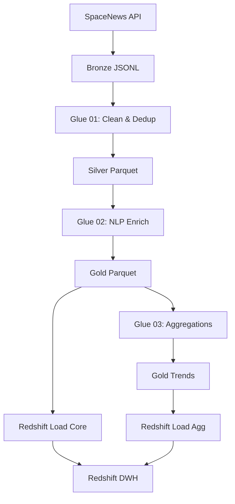

# SpaceNews Data Pipeline - Technical Documentation

## Data Volume Estimation
- **Current Volume**: ~35,000 historical articles + blogs + reports
- **Daily Rate**: ~100-200 new items per day
- **Bronze Storage**: ~50 MB/day JSONL (raw API responses)
- **Silver Storage**: ~20 MB/day Parquet (deduplicated, compressed)
- **Gold Storage**: ~25 MB/day Parquet (with NLP topics/entities/keywords)
- **Annual Projection**: ~10 GB/year total (Bronze+Silver+Gold)

## Storage and Partitioning Strategy
- **Partitioning**: All data partitioned by `ingest_date=YYYY-MM-DD`
- **File Formats**: 
  - Bronze: JSON Lines (immutable, append-only)
  - Silver/Gold: Parquet (columnar, snappy compression)
- **S3 Layout**:
  - Bronze: `s3://monokera-bucket/data/bronze/{endpoint}/ingest_date=YYYY-MM-DD/`
  - Silver: `s3://monokera-bucket/data/silver/content_clean/ingest_date=YYYY-MM-DD/`
  - Gold: `s3://monokera-bucket/data/gold/content_enriched/ingest_date=YYYY-MM-DD/`
- **Search**: Redshift queries use partition pruning for fast date-range analytics

## Data Quality Checks and Deduplication Rules
- **Schema Validation**: Enforced in Bronze extraction (400+ fields validated)
- **Deduplication**: Primary by `(content_type, id)`, secondary by `url` (keeps latest by `updated_at`)
- **Data Quality**: Null checks on required fields (title, url, published_at)
- **Record Hashing**: SHA-256 used in SCD Type 2 to detect content changes
- **Metrics**: Row counts logged at each layer (Bronze→Silver→Gold→Redshift)

## Business Rules for NLP Topics, Entities, and Trends
- **Topics** (11 categories): ISS, SpaceX, Launch, NASA, Mars, Moon, Satellite, Crew Dragon, James Webb, Artemis, Starship
  - Classification via regex pattern matching on title + summary
  - Multiple topics per article allowed
- **Entities Extracted**:
  - Companies: SpaceX, NASA, Blue Origin, ESA, Roscosmos, CNSA
  - People: Elon Musk, Jeff Bezos, Bill Nelson
  - Locations: Mars, Moon, ISS, Kennedy Space Center
- **Trends Aggregation**:
  - Monthly topic counts: how many articles per topic per month
  - Monthly source activity: how many articles per news_site per month

## Data Flow

